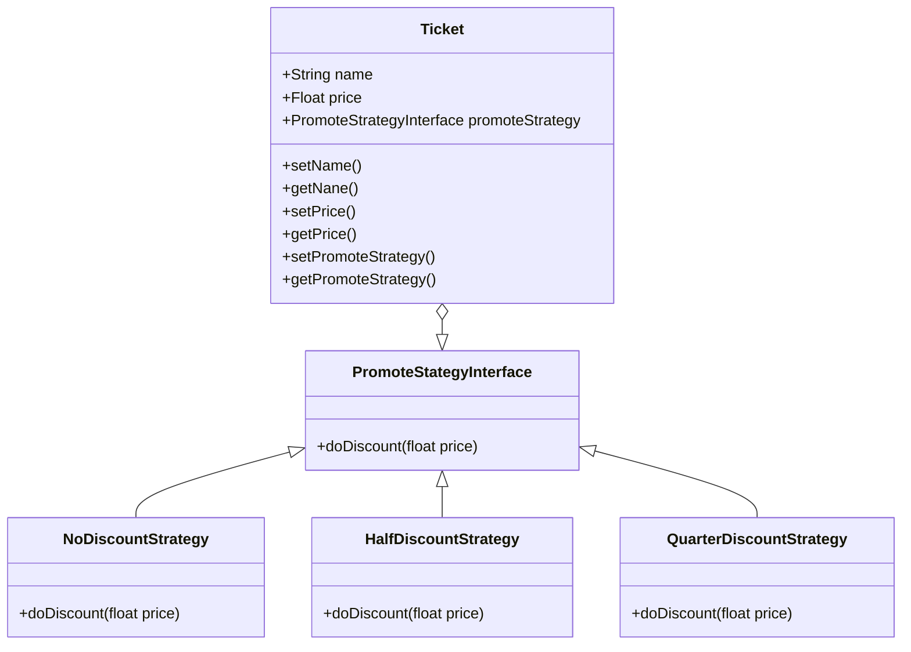

# Strategy example in PHP
This is an example of a strategy pattern in PHP.

## Description
The strategy pattern is a behavioral design pattern that allows you to define a family of algorithms, put each of them into a separate class, and make their objects interchangeable.

## UML

## Installation
```bash
composer install
php src/main.php
```

## Usage
```php
$context = new Context(new ConcreteStrategyA());
$context->execute();
```

## Output
```bash
Strategy A
```

