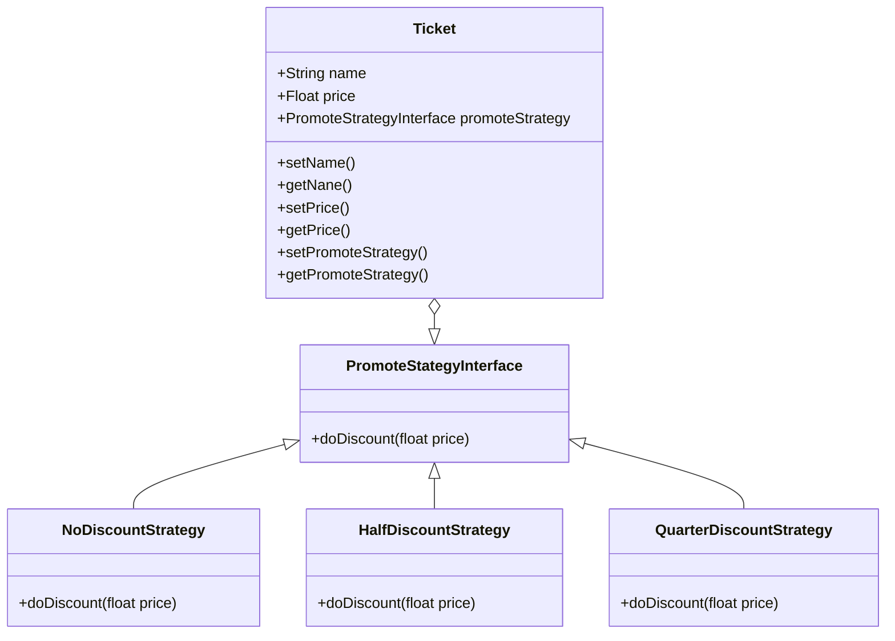

# Strategy example in PHP
This is an example of a strategy pattern in PHP.

## Description
The strategy pattern is a behavioral design pattern that allows you to define a family of algorithms, put each of them into a separate class, and make their objects interchangeable.

## UML

## Installation
```bash
composer install
php src/main.php
```

## Usage

### No discount
```php
// $ticket = new Ticket(new NoDiscountStrategy());
// or
$ticket = new Ticket();
$ticket->setPromoteStrategy(new NoDiscountStrategy());
$ticket->setName('Strategy A');
$ticket->setPrice(100);
$promoted = $ticket->getPromotedPrice();
echo "{$ticket->getName()} price: {$ticket->getPrice()} promoted price: {$promoted}" . PHP_EOL;
```

### Output
```bash
Ticket A price: 100 promoted price: 100
```

### Half discount
```php
// $ticket = new Ticket(new HalfDiscountStrategy());
// or
$ticket = new Ticket();
$ticket->setPromoteStrategy(new HalfDiscountStrategy());
$ticket->setName('Strategy B');
$ticket->setPrice(100);
$promoted = $ticket->getPromotedPrice();
echo "{$ticket->getName()} price: {$ticket->getPrice()} promoted price: {$promoted}" . PHP_EOL;
```

### Output
```bash
Ticket B price: 100 promoted price: 50
```

### Quarter discount
```php
// $ticket = new Ticket(new QuarterDiscountStrategy());
// or
$ticket = new Ticket();
$ticket->setName('Strategy C');
$ticket->setPrice(100);
$promoted = $ticket->getPromotedPrice();
echo "{$ticket->getName()} price: {$ticket->getPrice()} promoted price: {$promoted}" . PHP_EOL;
```

